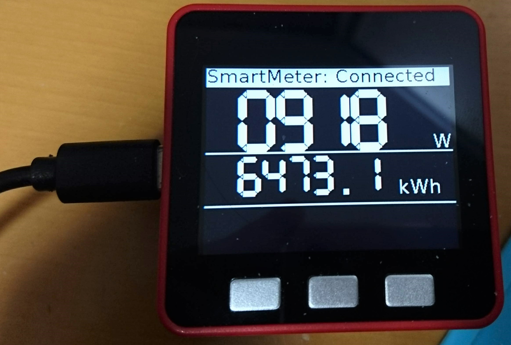

# M5Stack用 Wi-SUN拡張モジュール

## 概要

M5StackにロームのWi-SUNモジュール BP35A1 をつなぐための拡張モジュールの設計データ



* [動画](https://youtu.be/MU2Bb5bknPw)

## ファームウェア

* ビルド済みのカスタムMicroPythonバイナリと、pythonディレクトリに入っているスクリプトを含むSPIFFSイメージを書き込むように設定したM5BurnerをOneDriveに置いてあるので適当に使ってください。

https://1drv.ms/f/s!AvgeuJrD0ORom7oEdzDq509qd-Dngg

* M5Stackの公式にM5Burnerの再配布の許可をもらおうとTwitterでmentionを送ったら、公式の方に含めていただけることになりましたので、公式M5BurnerにあるWiSUNというファームを書き込むのでも良いです。

### 機能

* スマートメーターから瞬時電力、瞬時電流、積算電力量を取得してM5Stackの画面に簡易表示
* SORACOM Inventory + SORACOM Harvestを使って上記データを収集・可視化

### 使い方

1. ファームウェアを書き込んだあと、USBケーブルをPCにつないだままでTeraTermなどのターミナルでM5Stackのシリアルポートを開きます。
2. リセットがかかって、そのうち `Input SSID:` とプロンプトが表示されますので、接続先Wi-FiアクセスポイントのSSIDを入力してEnterを押します。
3. 次に `Input Password:` と表示されますのでWi-Fi接続のパスワードを入力します。 (*で隠されたりしないので、覗き見られないように注意してください。)
4. そのまましばらくすると M5StackのIPアドレスを表示したのち、`appconfig` が無いというエラーで停止し、 REPLの状態になります。
5. M5Stackの同一ネットワークにいるPCからWinSCPなどの`FTP`クライアント機能で (4)に表示されたアドレスに接続します。ユーザー名とパスワードは両方とも `esp32` です。
6. FTP経由でのファイル転送が可能になりますので、appconfig.pyという名前で以下の内容のファイルを作って M5Stackの `/flash` 以下にアップロードします。

```python
wifi_ssid = 'Wi-FiのSSID'
wifi_password = 'Wi-Fiのパスワード'
route_b_id = 'Route BのID (電力会社から教えてもらうやつ)'
route_b_password = 'Route Bのパスワード (電力会社から教えてもらうやつ)'
inventory_id = 'SORACOM InventoryのデバイスID'
inventory_password = 'SORACOM Inventoryのデバイス用パスワード'
```

7. M5Stackのリセットボタンを押してリセットします。

## (書きかけ)
